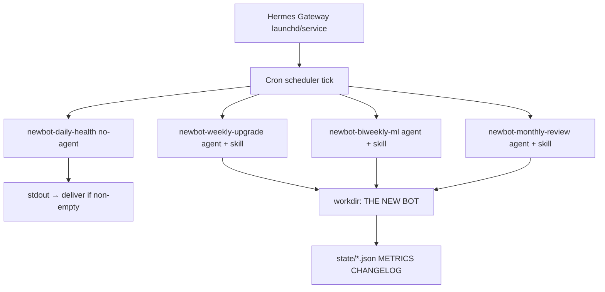

# Hermes Agent — THE NEW BOT continuous operator

This runbook turns `UPGRADE_SCHEDULE.md` into **scheduled Hermes cron jobs** that fire reliably while the gateway is running.

---

## Architecture



| Job | Schedule | Mode | Purpose |
|-----|----------|------|---------|
| `newbot-daily-health` | `0 22 * * 1-5` | **no-agent** script | Structure/version/metrics staleness |
| `newbot-weekly-upgrade` | `0 10 * * 0` | **agent** + skill | One backlog item on `WEMADEIT_dev.mq5` |
| `newbot-biweekly-ml` | `0 11 1,15 * *` | **agent** + skill | Retrain ONNX (1st and 15th) |
| `newbot-monthly-review` | `0 9 1 * *` | **agent** + skill | Debt, ProfitMaximizer, backtest notes |

All agent jobs use:

- `--workdir "/Users/samueladjaye/METATRADER 5 MQL5/THE NEW BOT"`
- `--skill the-new-bot-upgrade`
- `hermes cron --accept-hooks create ...` (non-interactive cron)

---

## One-time setup (required for consistency)

### 1. Install and start the gateway

Cron does **not** run until the gateway is active.

```bash
hermes gateway status          # should show running after install
hermes gateway install         # macOS user LaunchAgent (persists across reboot)
# OR foreground while testing:
hermes gateway                 # terminal must stay open
```

After install, reboot or run `hermes gateway start`.

### 2. Bootstrap project folders

```bash
cd "/Users/samueladjaye/METATRADER 5 MQL5/THE NEW BOT"
mkdir -p archive logs/weekly state backtests scripts
test -f WEMADEIT_dev.mq5 || cp WEMADEIT.mq5 WEMADEIT_dev.mq5
python3 -m venv .venv 2>/dev/null || true
".venv/bin/pip" install -r requirements.txt
```

### 3. Install Hermes health script (no-agent)

```bash
cp "/Users/samueladjaye/METATRADER 5 MQL5/THE NEW BOT/scripts/newbot-health-check.py" \
   ~/.hermes/scripts/newbot-health-check.py
chmod +x ~/.hermes/scripts/newbot-health-check.py
```

### 4. Register cron jobs

```bash
cd "/Users/samueladjaye/METATRADER 5 MQL5/THE NEW BOT"
./scripts/install-hermes-cron.sh
hermes cron list
```

### 5. Optional — deliver to Telegram/Discord

Edit `scripts/install-hermes-cron.sh` and set `DELIVER="telegram"` (or `origin`) before running.

---

## Manual triggers (testing)

```bash
hermes cron run newbot-daily-health
hermes cron run newbot-weekly-upgrade
hermes cron tick    # run all due jobs once
```

---

## State machine

| File | Role |
|------|------|
| `state/backlog.json` | Phase, `current_item_id`, ordered items |
| `state/last_run.json` | Last cron result, blockers, `compile_pending` |
| `METRICS.md` | Human + agent weekly scorecard |
| `CHANGELOG.md` | Version history |

Hermes **advances** `current_item_id` only when weekly work completes and `scripts/health_check.py` passes.

---

## What Hermes cannot automate (you do in MT5)

- MetaEditor compile
- Strategy Tester backtest
- Demo forward test (5+ days)
- Copy `regime_classifier.onnx` to terminal `MQL5/Files/`

Agent runs set `compile_pending: true` and list these in the run report.

---

## Reliability checklist

| Check | Command |
|-------|---------|
| Gateway up | `hermes gateway status` |
| Jobs registered | `hermes cron list` |
| Skill visible | `hermes skills list \| grep new-bot` |
| Last cron output | `ls -lt ~/.hermes/cron/output/` |
| Doctor | `hermes doctor` |

---

## Pausing upgrades

```bash
hermes cron pause newbot-weekly-upgrade
hermes cron resume newbot-weekly-upgrade
hermes cron remove newbot-weekly-upgrade
```

---

## Updating the plan

1. Edit `UPGRADE_SCHEDULE.md` and `state/backlog.json` together.
2. Bump skill version comment in `~/.hermes/skills/devops/the-new-bot-upgrade/SKILL.md` if rules change.
3. No gateway restart needed — jobs load fresh prompts each tick.

---

*Gateway not running = zero automated upgrades. Install the gateway before expecting consistency.*
