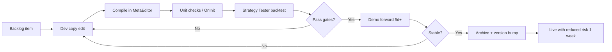

# THE NEW BOT — Continuous Upgrade Schedule

**Location:** `/Users/samueladjaye/METATRADER 5 MQL5/THE NEW BOT`  
**Last reviewed:** 2026-05-25  
**Purpose:** Repeatable cadence to improve, test, and deploy changes without breaking live trading.

---

## 1. Current state (baseline)

| Track | Primary file(s) | Version / status |
|-------|-----------------|------------------|
| **ICT / Smart Money (active dev)** | `WEMADEIT.mq5`, `new_strategy.mq5` | v1.00 — most recent edits (Aug 2025) |
| **Multi-strategy legacy** | `Enhanced_Smart_Money_Trader_v7.0.mq5` | v4.0 (trimmed fork) |
| **Legacy monolith** | `Enhanced_Smart_Money_Trader_v5/v6/Fixed.mq5` | v5.0 (~333 KB) — avoid new features here |
| **Profit layer** | `ProfitMaximizer.mqh`, docs in `How_To_Implement_*.txt` | Documented, not fully wired into ICT EAs |
| **ML regime** | `train_regime_model.py`, `regime_classifier.onnx`, `ML_Regime_Demo.mq5` | Demo only — not integrated into main EAs |

**Canonical production target (pick one and stick to it):**  
→ Recommend **`WEMADEIT.mq5`** as the single “main” EA; treat `new_strategy.mq5` as experimental branch until merged.

---

## 2. Versioning rules

Use **semantic-style tags in filename + `#property version`**:

| Change type | Example | Bump |
|-------------|---------|------|
| Bug fix, no behavior change | `WEMADEIT.mq5` 1.00 → 1.01 | PATCH |
| Risk / filters / defaults | 1.01 → 1.10 | MINOR |
| New strategy module or ML in live path | 1.10 → 2.00 | MAJOR |

**On every release:**

1. Copy working file to `archive/WEMADEIT_v1.01_2026-05-25.mq5` (create `archive/` once).
2. Update `#property version` and a one-line `CHANGELOG.md` entry.
3. Never edit archived copies.

---

## 3. Recurring calendar

### Daily (5–15 min) — when markets are open or after session close

| Task | Action |
|------|--------|
| Journal scan | MT5 Experts tab: errors, rejected orders, spread skips |
| Risk check | Daily loss %, trade count vs `MaxDailyLoss` / `MaxDailyTrades` |
| Log one line | Note: symbol, session, win/loss, reason (FVG / OB / pump / etc.) |

### Weekly (Sunday or Monday, ~1–2 hours) — **primary upgrade window**

| Step | Task | Done when |
|------|------|-----------|
| W1 | Export last week’s deals to CSV (MT5 → Account History) | File saved in `logs/weekly/` |
| W2 | Scorecard: win rate, avg R, max DD, trades per session | Filled in `METRICS.md` (template below) |
| W3 | Pick **one** upgrade item from backlog (Section 5) | Issue/ticket named `upgrade-YYYY-Www` |
| W4 | Implement in **dev copy** only (`WEMADEIT_dev.mq5` or git branch) | Compiles with 0 errors |
| W5 | Strategy Tester: same symbol/TF/period as prior week | Results within ±15% of baseline OR documented why |
| W6 | Demo forward test 5+ trading days before any live change | Journal shows expected behavior |

### Bi-weekly (every 2 weeks, ~30 min) — **ML / Python**

| Task | Command / action |
|------|------------------|
| Retrain regime model | `".venv/bin/python" train_regime_model.py --symbol ... --lookback_days 365` |
| Compare ONNX | New vs old class distribution; no silent class collapse |
| Deploy | Copy `regime_classifier.onnx` + `regime_classes.json` to terminal `MQL5/Files/` |
| Validate | Run `ML_Regime_Demo.mq5` on chart; confirm Journal output |

### Monthly (first weekend, ~3–4 hours) — **integration & debt**

| Priority | Task |
|----------|------|
| M1 | Merge or delete duplicate EAs (keep archive, one canonical) |
| M2 | Integrate **one** ProfitMaximizer feature into canonical EA (trailing → regime → partials) |
| M3 | Full multi-symbol backtest matrix (see Section 6) |
| M4 | Review inputs: disable unused flags (`EnableNDOG`, etc.) if never triggered |
| M5 | Update `requirements.txt` pins; recreate venv if needed |

### Quarterly (half day) — **strategy & architecture**

| Task | Outcome |
|------|---------|
| Q1 | Decide: ICT track vs Enhanced Smart Money track (or formal split into two products) |
| Q2 | Major version bump if ML regime gates entries/exits in production |
| Q3 | Walk-forward / out-of-sample period not used in tuning |
| Q4 | Live vs demo P&amp;L reconciliation; adjust risk % if DD exceeded plan |

---

## 4. Upgrade pipeline (every change)



### Gates (must pass before demo → live)

| Gate | Rule |
|------|------|
| Compile | 0 errors, 0 critical warnings |
| Backtest | Profit factor ≥ prior baseline **or** max DD ≤ prior **and** trade count ≥ 80% of prior |
| Regressions | No new “invalid stops”, “not enough money”, or order spam |
| Risk | Max DD in test ≤ 1.5× your live risk budget |
| ML | If model changed: demo agrees with Python labels on 20 random bars (manual spot check) |

**Live rollout:** First week at **50%** `RiskPercent`; restore full only after 10 trades with no anomalies.

---

## 5. Prioritized upgrade backlog (rotate weekly)

Work **top to bottom**, one item per week unless blocked.

### Phase A — Stability (weeks 1–4)

1. Single canonical EA + `archive/` folder; stop editing v5/v6 monoliths.
2. Centralize magic number / symbol validation in `OnInit`.
3. Fix spread/session throttles using last week’s Journal data.
4. Structured logging: `PrintFormat` with tag `[WEMADEIT|ENTRY|EXIT|RISK]`.

### Phase B — Risk & execution (weeks 5–8)

5. Wire `ProfitMaximizer.mqh` — start with multi-stage trailing only.
6. Session-aware max trades (London / NY already in inputs — verify enforcement).
7. Stagnant trade exit (from ProfitMaximizer docs).
8. Adaptive lots only when `EnableAdaptiveLots` + confidence score defined.

### Phase C — ML integration (weeks 9–12)

9. Load ONNX in canonical EA (copy pattern from `ML_Regime_Demo.mq5` + `OnnxModel.mqh`).
10. Regime → adjust `RR_Ratio`, trail distance, or block entries in RANGING.
11. Automate bi-weekly retrain + file copy checklist.
12. Feature parity: same `num_features` in Python and MQL5 return vector.

### Phase D — Strategy edge (ongoing)

13. Diff `new_strategy.mq5` vs `WEMADEIT.mq5`; merge one feature per week (Judas Swing, CE, etc.).
14. HTF bias optional path (`UseHTFBias`) — A/B test on demo.
15. Pump catcher tuning from win/loss tags in `METRICS.md`.

---

## 6. Backtest matrix (monthly)

Run the **canonical EA** on:

| Symbol | Timeframe | Period | Model |
|--------|-----------|--------|-------|
| Primary pair you trade | H1 | Last 12 months | Every tick / 1 min OHLC |
| Same | H4 | Last 12 months | Sanity check |
| Secondary pair | H1 | Last 6 months | Robustness |

Save reports as: `backtests/YYYY-MM_SYMBOL_TF.html` or screenshot + notes in `METRICS.md`.

---

## 7. Metrics template (`METRICS.md`)

Create once; append each week:

```markdown
## Week 2026-W21
- EA version: 1.02
- Symbol / TF: XAUUSD H1
- Trades: 12 | Win%: 58 | Avg R: 1.4 | Max DD: 3.2%
- Notes: Reduced pump entries; spread filter triggered 4x
- Next upgrade: #6 trailing stop from ProfitMaximizer
```

---

## 8. Environment & tooling checklist

| Item | Frequency |
|------|-----------|
| MT5 build ≥ 5200 (ONNX) | Check quarterly |
| Python `.venv` + `requirements.txt` | After monthly pip updates |
| MetaEditor compile | Every code change |
| Backup entire `THE NEW BOT` folder | Weekly (Time Machine / copy to cloud) |
| MT5 `MQL5/Files/` ONNX artifacts | After each bi-weekly retrain |

---

## 9. What **not** to do

- Do not add features to multiple files (`WEMADEIT`, `new_strategy`, v7) in the same week.
- Do not skip demo after backtest “because it looked good.”
- Do not increase `RiskPercent` and add strategy logic in the same release.
- Do not deploy untested ONNX without keeping the previous `.onnx` as `regime_classifier.prev.onnx`.

---

## 10. Quick start (this week)

| Day | Action |
|-----|--------|
| Today | Choose canonical EA: `WEMADEIT.mq5`; create `archive/`, `logs/weekly/`, `METRICS.md` |
| This week | Upgrade #1: copy to `WEMADEIT_dev.mq5`, add CHANGELOG, fix one Journal error |
| Next week | Upgrade #5: include `ProfitMaximizer.mqh` trailing only |
| In 2 weeks | Bi-weekly ML retrain + demo script validation |

---

## 11. Hermes agent (continuous operator)

**Runbook:** `HERMES_RUNBOOK.md`  
**Skill:** `~/.hermes/skills/devops/the-new-bot-upgrade/SKILL.md`  
**State:** `state/backlog.json`, `state/last_run.json`

| Cron job | Schedule | What runs |
|----------|----------|-----------|
| `newbot-daily-health` | Mon–Fri 22:00 | No-agent script — alerts only if checks fail |
| `newbot-weekly-upgrade` | Sunday 10:00 | Agent + skill — one backlog item on `WEMADEIT_dev.mq5` |
| `newbot-biweekly-ml` | 1st & 15th 11:00 | Agent — retrain ONNX |
| `newbot-monthly-review` | 1st 09:00 | Agent — debt / ProfitMaximizer / metrics |

**One-time setup:**

```bash
hermes gateway install && hermes gateway start
cd "/Users/samueladjaye/METATRADER 5 MQL5/THE NEW BOT"
./scripts/install-hermes-cron.sh
```

Cron does not fire until the **Hermes gateway** is running (`hermes gateway status`).

### Other automation

- Cursor rule in project: “Only edit `WEMADEIT_dev.mq5` unless releasing.”
- Git repo in this folder: `main` = live version, `dev` = weekly work.

---

*This schedule is living documentation. After each monthly review, adjust phase order based on live results—not backtest alone.*
